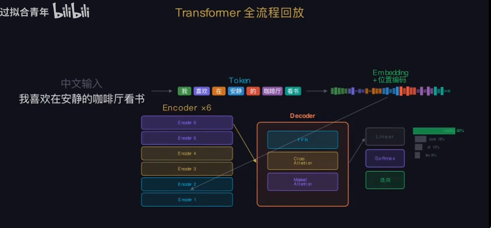

# 用机器翻译任务讲解Transformer架构原理

## Transformer架构原理
[参考视频](https://b23.tv/c9buhW6)

给你一个任务翻译一句话:
我喜欢在安静的咖啡厅看书。
I like reading in a quiet cafe.

Transformer之前RNN是翻译特点：
（1）按顺序一个一个读，句子越长前边的信息丢的越多
（2）流水线作业无法并行训练模型

Transformer全流程:

我已按你给的 B 站视频《【硬核】彻底搞懂 Transformer | ChatGPT 的心脏长什么样？》，把**30 分钟内容完整提炼成精简版核心笔记**，不跳步骤、不省关键细节，直接能看懂。

---

### 🧠 视频核心一句话
**Transformer = 现在所有大模型（ChatGPT/GPT‑4/Claude/Gemini）的底层架构**，视频用**机器翻译**任务，从头到尾拆透每一个模块。

### 1️⃣ 输入预处理（看懂一句话）
1. **Token 化**
   把句子切成模型能处理的最小单元（词/子词）。
2. **Embedding 词嵌入**
   把 Token 转成向量，让计算机“懂词义”。
3. **位置编码 Positional Encoding**
   给每个词加**顺序信息**，让模型知道谁在前谁在后。

### 2️⃣ 灵魂：Self‑Attention 自注意力（Q/K/V）
- **Q（Query）**：我在问“谁和我相关”
- **K（Key）**：我在回答“我和你有多配”
- **V（Value）**：真正要传递的语义信息
- 计算流程：
  Q·Kᵀ → 缩放 → Softmax → 加权 V → 输出
- 作用：**每个词能看到整句话，自动抓上下文关联**（长文本不崩）。

### 3️⃣ 升级：Multi‑Head Attention 多头注意力
- 把 QKV 分成多组并行算
- 不同头负责：语法、指代、逻辑、长距离依赖等
- 最后拼接，**语义更丰富、更细**。

### 4️⃣ 每层标配：残差连接 + Layer Norm
- **残差 Add**：防梯度消失，能堆很深的层
- **层归一化 Norm**：训练更稳、收敛更快
- 结构：**SubLayer → Add → Norm**。

### 5️⃣ 加工层：FFN 前馈网络
- 对每个词向量单独做两层线性变换+激活
- 做**深度语义提纯**，不改变序列长度。

### 6️⃣ 整体架构：Encoder + Decoder
- **Encoder（理解端）**
  双向注意力，吃透输入全文（像做阅读理解）。
- **Decoder（生成端）**
  1. **Masked 自注意力**：只能看前面已生成的词，防止“偷看未来”
  2. **Cross‑Attention 交叉注意力**：一边生成一边回看 Encoder 的理解结果
  3. 最后 Linear+Softmax 输出下一个词概率。

### 7️⃣ 生成方式：自回归 Autoregressive
- 一次只生成**一个 Token**
- 把刚生成的词丢回输入，继续生成下一个
- 直到输出结束符，这就是**ChatGPT 打字的原理**。

### 8️⃣ 视频总结的关键意义
- 干掉 RNN/LSTM 串行瓶颈，**支持大规模并行训练**
- 长文本依赖极强，是大模型能做大的关键
- GPT、BERT、Claude、Gemini 全是它的变体
- **Transformer = 当代 AI 的“标准发动机”**。

---

# 原理速记清单

## 一、核心定位
Transformer 是2017年《Attention Is All You Need》提出的架构，**是ChatGPT、所有大语言模型的底层核心**，彻底取代RNN/LSTM，依靠**自注意力机制**实现并行训练。

## 二、整体架构
整体分为两大模块：**Encoder 编码器 + Decoder 解码器**
1. **Encoder**：双向注意力，负责**理解输入**（BERT只用编码器）
2. **Decoder**：单向注意力，负责**生成输出**（GPT只用解码器）
3. 经典场景：机器翻译=编码器理解原文+解码器生成译文

## 三、输入预处理三步
1. **Token分词**：把文字拆分为模型最小处理单元
2. **Embedding词嵌入**：文字转为高维向量，承载语义
3. **Positional Encoding位置编码**：给向量加入**位置时序信息**
> 重点：Transformer没有循环结构，本身不知道语序，必须靠位置编码

## 四、核心灵魂：Self-Attention 自注意力
### 1. 三个核心向量
- Q(Query)：查询，当前词要去找相关词
- K(Key)：键，所有词提供自身特征
- V(Value)：值，真正传递的语义内容

### 2. 计算流程（背诵口诀）
**Q乘K转置 → 缩放防梯度爆炸 → Softmax归一化权重 → 加权求和V**

### 3. 作用
让**每个单词可以全局感知整句上下文**，解决长距离依赖问题。

## 五、多头注意力 Multi-Head Attention
1. 把QKV切分成多组，并行计算注意力
2. 不同头学习不同特征：语法、指代、长距离依赖
3. 最后拼接融合，语义表达更强

## 六、通用模块（编码器/解码器都有）
1. **残差连接 Add**：解决深层网络梯度消失问题
2. **Layer Norm层归一化**：稳定训练，加速收敛
3. **FFN前馈神经网络**：对单个向量做非线性语义提纯，独立运算

## 七、Decoder解码器独有机制
1. **Masked 掩码自注意力**：屏蔽未来位置，生成时只能看前面已生成的词，不能“偷看未来”
2. **Cross-Attention交叉注意力**：解码器查询编码器的输出，把理解的信息融入生成

## 八、大模型生成原理（ChatGPT核心）
**自回归生成**：
每次只生成**一个Token**，将生成的token重新放回输入，循环迭代，直到生成结束符。

## 九、Transformer 核心优势（面试必答）
1. 摒弃串行循环结构，**支持全局并行训练**
2. 自注意力天然解决**长距离依赖**
3. 架构可无限堆叠，支撑千亿、万亿参数大模型

## 十、经典模型区分
- GPT系列：**只用Decoder**，自回归生成模型
- BERT系列：**只用Encoder**，双向理解模型
- 原始Transformer：Encoder+Decoder，适用于翻译任务

我可以再给你做一份**思维导图版**，或者**带公式的精讲版**，你想要哪个？

**Transformer = 现在所有大模型（ChatGPT/GPT‑4/Claude/Gemini）的底层架构**，视频用**机器翻译**任务，从头到尾拆透每一个模块。

### 1️⃣ 输入预处理（看懂一句话）

1.  **Token 化** 把句子切成模型能处理的最小单元（词 / 子词）。
2.  **Embedding 词嵌入** 把 Token 转成向量，让计算机 “懂词义”。
3.  **位置编码 Positional Encoding** 给每个词加**顺序信息**，让模型知道谁在前谁在后。

### 2️⃣ 灵魂：Self‑Attention 自注意力（Q/K/V）

*   **Q（Query）**：我在问 “谁和我相关”
*   **K（Key）**：我在回答 “我和你有多配”
*   **V（Value）**：真正要传递的语义信息
*   计算流程： Q・Kᵀ → 缩放 → Softmax → 加权 V → 输出
*   作用：**每个词能看到整句话，自动抓上下文关联**（长文本不崩）。

### 3️⃣ 升级：Multi‑Head Attention 多头注意力

*   把 QKV 分成多组并行算
*   不同头负责：语法、指代、逻辑、长距离依赖等
*   最后拼接，**语义更丰富、更细**。

### 4️⃣ 每层标配：残差连接 + Layer Norm

*   **残差 Add**：防梯度消失，能堆很深的层
*   **层归一化 Norm**：训练更稳、收敛更快
*   结构：**SubLayer → Add → Norm**。

### 5️⃣ 加工层：FFN 前馈网络

*   对每个词向量单独做两层线性变换 + 激活
*   做**深度语义提纯**，不改变序列长度。

### 6️⃣ 整体架构：Encoder + Decoder

*   **Encoder（理解端）** 双向注意力，吃透输入全文（像做阅读理解）。
*   **Decoder（生成端）**

    *   **Masked 自注意力**：只能看前面已生成的词，防止 “偷看未来”
    *   **Cross‑Attention 交叉注意力**：一边生成一边回看 Encoder 的理解结果
    *   最后 Linear+Softmax 输出下一个词概率。

### 7️⃣ 生成方式：自回归 Autoregressive

*   一次只生成**一个 Token**
*   把刚生成的词丢回输入，继续生成下一个
*   直到输出结束符，这就是**ChatGPT 打字的原理**。

### 8️⃣ 视频总结的关键意义

*   干掉 RNN/LSTM 串行瓶颈，**支持大规模并行训练**
*   长文本依赖极强，是大模型能做大的关键
*   GPT、BERT、Claude、Gemini 全是它的变体
*   **Transformer = 当代 AI 的 “标准发动机”**。

***

# 带公式

# Transformer 带公式通俗精讲版（适配你看的B站视频）
我全程**通俗大白话+核心公式**，重点讲明白：**Self-Attention公式、QKV到底是什么、GPT为什么只用Decoder、BERT为什么只用Encoder**。

---

## 一、先回顾：原始Transformer完整结构
原始论文架构：
**Encoder（编码器） + Decoder（解码器）**
- Encoder：**双向理解**，看完整上下文
- Decoder：**单向生成**，逐字输出

机器翻译场景：
原文→Encoder理解 → Decoder读取Encoder结果→翻译出译文

---

## 二、核心：自注意力 Self-Attention 公式（视频核心）
### 1. 标准公式
$$
\text{Attention}(Q,K,V) = \text{Softmax}\left( \frac{QK^T}{\sqrt{d_k}} \right)V
$$

### 2. 逐词通俗解释
- $Q$ Query：**我是谁，我要去找谁**（当前词的查询向量）
- $K$ Key：**我有什么特点**（所有词的特征向量）
- $V$ Value：**我真正要传递的内容**（语义向量）

计算逻辑一步步拆：
1. $QK^T$：计算**两个词之间的相似度**，相似度越高，权重越大
2. $\sqrt{d_k}$ 缩放：防止向量维度太大，点积数值爆炸，Softmax失效
3. Softmax：把相似度变成**0~1的权重概率**
4. 乘 $V$：用权重加权所有词的语义，得到**融合全局上下文的新向量**

### 3. 人话总结
自注意力 = **看全局，给相关词加权，融合上下文**

---

## 三、多头注意力 Multi-Head 公式+理解
$$
\text{MultiHead}(Q,K,V) = \text{Concat}(\text{head}_1,\text{head}_2,...,\text{head}_h)W^O
$$
$$
\text{head}_i = \text{Attention}(QW_i^Q,KW_i^K,VW_i^V)
$$

通俗理解：
- 单头：只能学一种语义关系
- 多头：**分头干活**，有的学语法、有的学指代、有的学长距离依赖
- 最后拼接合并，表达能力更强

---

## 四、残差连接 + 层归一化（公式+作用）
$$
\text{LayerNorm}(x + \text{Sublayer}(x))
$$

- 残差 $x+$：原始信息直接跳层传递，**解决梯度消失**，才能堆几十上百层
- LayerNorm：把数据归一化，训练更稳、收敛更快

---

## 五、关键问题：BERT 为什么只用 Encoder？
### 1. Encoder 自带特性
- 使用**双向自注意力**：一个词能同时看**左边+右边**所有单词
- 没有掩码，全局可见

### 2. BERT 训练任务：**完形填空式理解**
训练方式：
随机遮住句子里的部分单词，让模型**根据前后上下文预测被遮住的词**

### 3. 逻辑
既然是**理解语言、做语义分类、阅读理解**，就需要双向上下文
→ 只拿 Transformer 的 **Encoder 部分** 单独训练就够了

### 4. 结构简化
BERT = 多层 Encoder 堆叠 + 双向自注意力

---

## 六、重点难点：GPT 为什么只用 Decoder？
### 1. Decoder 里面有两种注意力
1. **掩码自注意力 Masked Self-Attention**
2. **交叉注意力 Cross-Attention**（GPT直接删掉了）

### 2. 掩码注意力公式思想
在计算注意力矩阵时，**右上角全部置为 -∞**
Softmax后权重直接变成0

效果：
**第i个词，只能看到1~i的词，看不到i后面的未来词**

### 3. GPT 的训练逻辑：自回归预测
训练任务：**给定前面所有字，预测下一个字**
例如：
`我 今天 想吃 ____`
模型学习：根据前文预测下一个Token

### 4. GPT 做了什么精简？
原始Decoder有两个注意力：
- 掩码自注意力（自身序列建模）
- 交叉注意力（看Encoder的输出）

**GPT直接砍掉了Cross-Attention，只保留：掩码多头自注意力 + FFN + 残差**

所以：
**GPT = 只用纯Decoder结构，去掉交叉注意力，单向自回归训练**

---

## 七、一张表彻底分清三者
| 模型 | 所用模块 | 注意力方式 | 核心任务 |
|------|----------|------------|----------|
| 原始Transformer | Encoder+Decoder | 双向+单向 | 机器翻译 |
| BERT | 仅Encoder | 双向全可见 | 语言理解、分类、填空 |
| GPT系列 | 仅简化Decoder | 掩码单向（只能看前文） | 文本生成、对话 |

---

## 八、通俗总结（背这个就懂了）
1. **Encoder**：双向看书，前后都能看，适合**理解** → BERT用它
2. **Decoder**：只能看前面，不能看后面，适合**一个字一个字写** → GPT用它
3. 自注意力公式核心：**算相似度→加权全局语义**
4. 大模型本质：**堆叠多层Transformer模块+海量数据预训练**

---

我可以给你做一份：
**逐行公式+手绘结构示意图版**，把QKV、掩码矩阵、Encoder/Decoder画出来，一看就懂。
需要我做吗？
